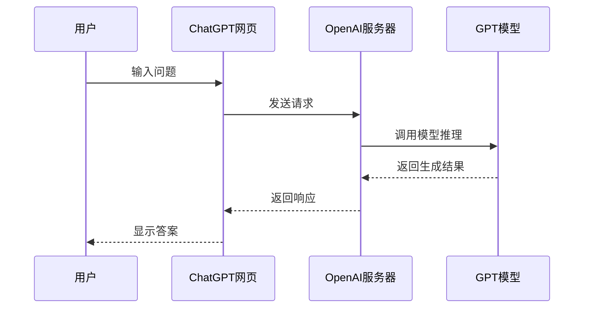
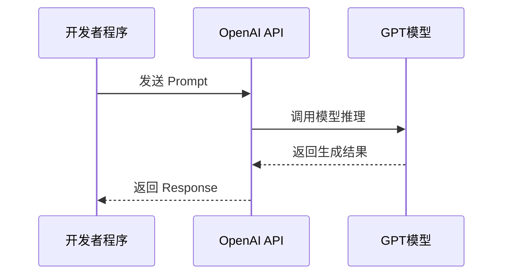
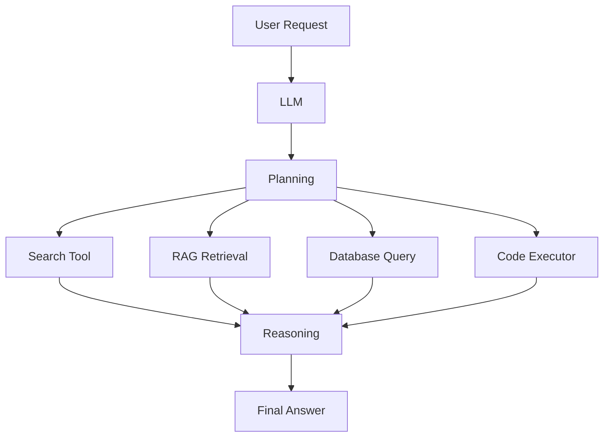

# OpenAI API 教程

## 为什么学习 OpenAI API

### 什么是LLM API

LLM API 是一种通过程序访问大语言模型能力的标准接口，它让你的代码能够与 GPT、Claude、Gemini、DeepSeek 等模型进行交互。

大多数人第一次接触大模型是这样的：

>   你：
>   什么是PPO？
>
>   ChatGPT：
>   PPO（Proximal Policy Optimization）是一种强化学习算法...

整个过程看起来很简单,模型经过思考后进行输出答案，但实际上 ChatGPT 背后也是在调用 LLM API，它的内部流程大致是这样的。



LLM API本质就是用户通过程序去调用大模型服务，而不是通过网页去调用大模型，也就是说它的流程是这样的。



### API 能做什么

现代 LLM API是一个能够理解语言、处理知识、调用工具、操作系统并完成复杂任务的智能引擎，与网页端最大的区别就是**自动化能力**，假如你要分析100篇论文，使用网页端只能不断去上传论文等待分析结果，使用LLM API可以自动执行并主动调用工具去执行任务总结结果。




### OpenAI生态概览

对于普通用户来说，最熟悉的是 ChatGPT 网页端，但对于开发者而言，真正重要的是 OpenAI 提供的一整套 API 能力。开发者可以通过 API 将大模型集成到自己的系统中，实现文本生成、代码生成、内容总结、信息抽取等功能。LLM是整个生态的核心，它负责理解用户输入、进行推理并生成结果，而 API 则是程序访问这些能力的标准接口。

在模型能力之上，OpenAI 还提供了许多**扩展能力**。

-   **结构化输出**：模型可以按照指定的 JSON 格式输出结构化数据，方便程序直接处理；
-   **Embedding**：可以利用 Embedding 将文本转换为向量，实现语义检索和知识库构建；
-   **Tools**：还可以通过 Tool Calling 调用外部工具，例如搜索引擎、数据库、GitHub、Arxiv 或企业内部系统，从而突破模型自身知识的限制；
-   **多模态（Multimodal）**：模型不仅能够处理文本，还能够理解图片、音频等多种数据形式，实现图像分析、OCR、语音理解等能力；

当 Embedding、向量数据库和大模型结合时，就形成了 RAG（Retrieval-Augmented Generation，检索增强生成）系统，使模型能够基于私有文档、论文库或业务数据进行准确回答。

## 第一个 OpenAI 程序

接下来，我们将编写第一个 OpenAI 程序，让 Python 代码真正与大模型进行交互，OpenAI 官方提供了 Python SDK，可以帮助我们更加方便地调用 API。

```bash
# openai安装命令
pip install openai 
```

在调用 OpenAI API 之前，需要先获取 API Key，API Key请妥善保管，不要上传到 GitHub 或公开仓库中，推荐使用**环境变量**管理 API Key。

```python
from openai import OpenAI

client = OpenAI()

response = client.responses.create(
    model="gpt-5",
    input="你好，请介绍一下强化学习。"
)

print(response.output_text)
```

## API 参数详解

在使用 OpenAI API 时，还需要通过各种参数来控制模型的行为。

```python
from openai import OpenAI

client = OpenAI()

response = client.responses.create(
    model="gpt-5",
    instructions="你是一位机器人学教授",
    input="解释 PPO 算法",
    max_output_tokens=1000
)

print(response.output_text)
```

-   `model`：指定使用的模型
-   `input`：用户输入内容，即发送给模型的 Prompt
-   `instructions`：系统级指令（System Prompt），定义模型角色、职责和行为规范
-   `max_output_tokens`：限制模型最大输出长度，防止生成过长内容
-   `top_p`：控制采样范围，只从概率最高的候选 Token 中进行选择
-   `temperature`：控制输出随机性，值越大创造性越强，值越小结果越稳定
-   `stream`：是否启用流式输出，开启后会像 ChatGPT 一样逐字返回结果
-   `response_format`：指定输出格式，例如 JSON、结构化数据等

其他参数详解可以参考：[https://developers.openai.com/api/reference/responses/overview](https://developers.openai.com/api/reference/responses/overview)

## 多轮对话系统

### Token计算

### 上下文压缩

### 长对话管理

## 结构化输出

### JSON模式

### Pydantic集成